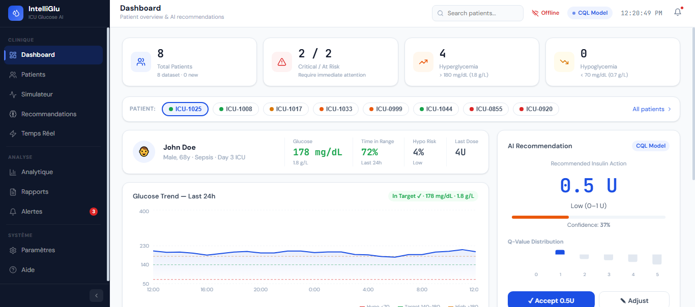
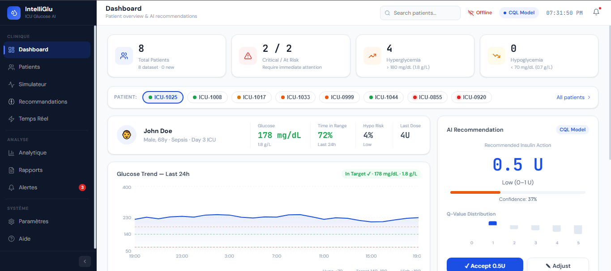
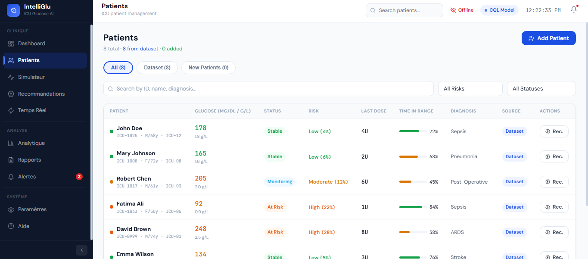
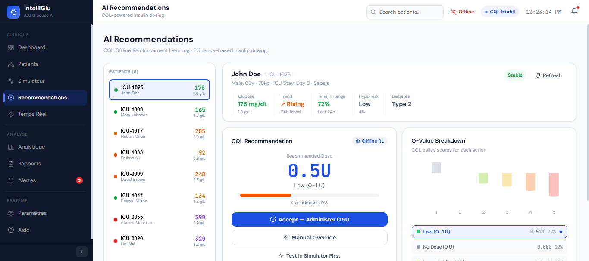
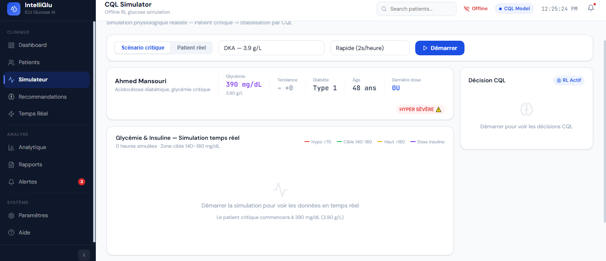
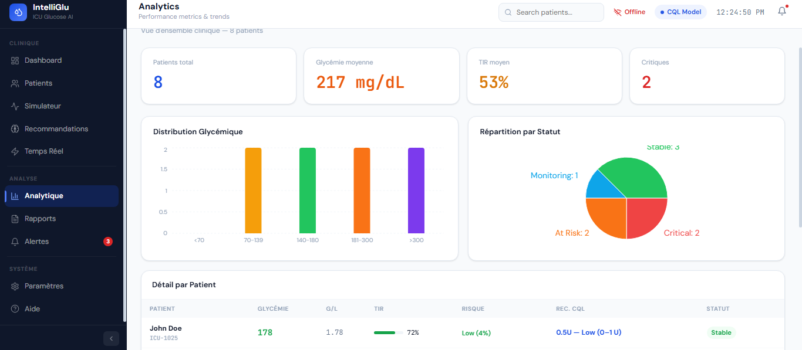
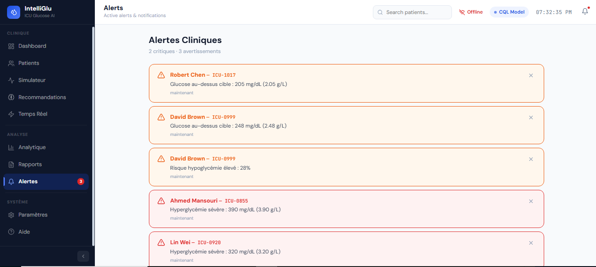
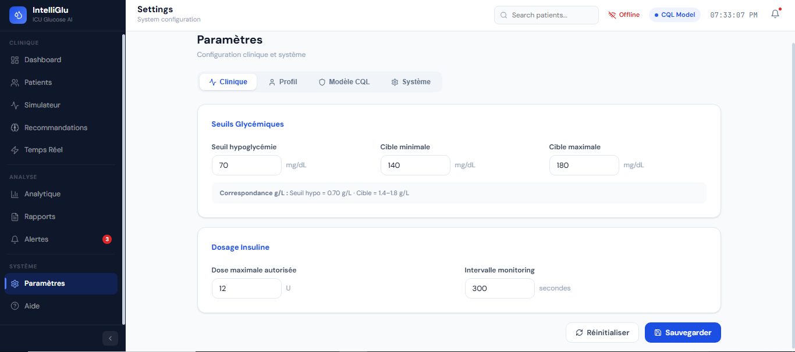

<p align="center">
  
</p>

<h1 align="center">IntelliGlu</h1>

<p align="center">
Clinical Decision Support System for ICU Glucose Monitoring and Insulin Dose Recommendation
</p>

<p align="center">


</p>

---

# Overview

IntelliGlu is a research project that explores the use of **Offline Reinforcement Learning (Conservative Q-Learning)** to assist insulin dosing in Intensive Care Units (ICUs).

The application combines a **FastAPI backend**, a **Next.js + Electron frontend**, and a trained CQL model to generate insulin dose recommendations from patient glucose measurements. Clinicians can review every recommendation before accepting it or overriding it manually.

The objective of the project is to study how reinforcement learning can support clinical decision-making while keeping the clinician in control.

---

# Features

- Offline Reinforcement Learning (Conservative Q-Learning) recommendation engine
- FastAPI REST API
- Interactive patient dashboard
- Patient management (CRUD)
- Glucose monitoring
- Real-time glucose simulator
- Recommendation review and manual override
- Safety rules for insulin dosing
- Analytics and reporting
- Desktop application with Electron
- Docker support

---

# System Architecture

```
                Next.js + Electron
                       │
                       ▼
                 FastAPI REST API
                       │
        ┌──────────────┼──────────────┐
        ▼              ▼              ▼
   Patient Data   RL Inference   Analytics
                       │
                       ▼
          Conservative Q-Learning Model
                       │
                       ▼
                Safety Validation
                       │
                       ▼
          Recommended Insulin Dose
```

---
---

# Model Evaluation & Results

The recommendation engine was evaluated offline against a held-out cohort from MIMIC-III (~146,000 transitions, ~10,000 ICU stays), comparing two offline RL algorithms: **BCQ** and **CQL**.

| Metric | BCQ | CQL |
|---|---|---|
| Off-Policy Value Estimate (WIS) | lower | **higher** |
| Clinician Agreement Rate | lower | **higher** |
| Safety Violation Rate | higher | **lower** |

CQL was selected as the production model due to more conservative, clinically safer dosing behavior — a critical requirement when the policy cannot be validated through live exploration.

Evaluation also included subgroup analysis (by glycemic severity band) to check the policy did not systematically under/over-treat specific patient groups.

> Full methodology (MDP formulation, reward shaping, off-policy evaluation) is documented in the accompanying thesis: *Offline Reinforcement Learning for Personalized Insulin Dosing in ICU*.
# What's New in v2

Version 2 introduces a complete backend architecture and several improvements to the recommendation workflow.

### Recommendation Engine

- Fixed the high-glucose recommendation logic.
- Frontend and backend now use the same inference rules.
- Improved consistency for glucose values above 400 mg/dL.

### Model Loading

- The backend automatically detects the state dimension stored in the trained model.
- Removed the dependency on hardcoded feature sizes.

### Backend

The FastAPI backend now provides endpoints for:

- Patient management
- Recommendations
- Simulation
- Reports
- Analytics
- Monitoring
- Settings

### Frontend

- Redesigned dashboard
- New patient management workflow
- Recommendation page connected to the backend
- Simulator integrated with recommendations
- Improved navigation and UI consistency

---

# Screenshots

## Dashboard

<p align="center">

</p>

---

## Patient Management

<p align="center">

</p>

---

## Recommendation Engine

<p align="center">

</p>

---

## Glucose Simulator

<p align="center">

</p>

---

## Analytics

<p align="center">

</p>

---

## Alerts

<p align="center">

</p>

---

## Settings

<p align="center">

</p>

---

# Technology Stack

## Backend

- Python
- FastAPI
- Pydantic
- Uvicorn
- Docker

## Machine Learning

- Conservative Q-Learning (CQL)
- PyTorch
- Offline Reinforcement Learning

## Frontend

- Next.js
- React
- TypeScript
- Tailwind CSS
- Electron

---

# Project Structure

```text
backend/
├── app/
│   ├── api/
│   ├── core/
│   ├── db/
│   ├── ml_models/
│   ├── rl/
│   │   ├── cql/
│   │   ├── ope/
│   │   └── safety/
│   ├── schemas/
│   ├── services/
│   └── main.py
└── docker-compose.yml

frontend/
├── app/
├── components/
├── hooks/
├── lib/
├── services/
└── electron/
```

---

# Getting Started

## Backend

```bash
cd backend/app

pip install -r requirements.txt

uvicorn main:app --reload --port 8000
```

Backend:

```
http://localhost:8000
```

---

## Frontend

```bash
cd frontend

npm install

npm run dev
```

Frontend:

```
http://localhost:3000
```

---

# Glucose Units

Internally, the recommendation model operates in **mg/dL**.

For usability, the interface displays glucose values in both:

- mg/dL
- g/L

| Glucose | Typical Recommendation |
|----------|------------------------|
| 300 mg/dL (3 g/L) | 4–6 U |
| 400 mg/dL (4 g/L) | ≥ 6 U |

---

# Why IntelliGlu?

This project was developed to investigate how Offline Reinforcement Learning can be applied to insulin dosing using retrospective ICU data.

Rather than replacing clinical judgment, IntelliGlu provides recommendations that clinicians can inspect, accept, or modify before administration.

The project combines machine learning with rule-based safety checks to encourage safe and explainable recommendations.

---

# Future Improvements

- Integration with hospital databases
- Authentication and user roles
- Additional reinforcement learning algorithms
- Explainable AI visualizations
- Model retraining pipeline
- Deployment to cloud infrastructure

---

# License

This repository was developed for research and educational purposes.
